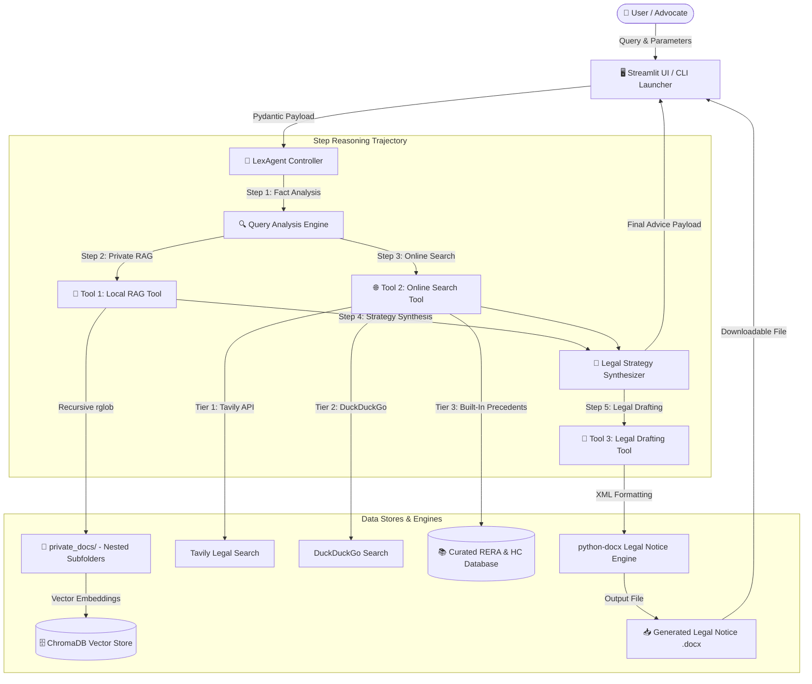
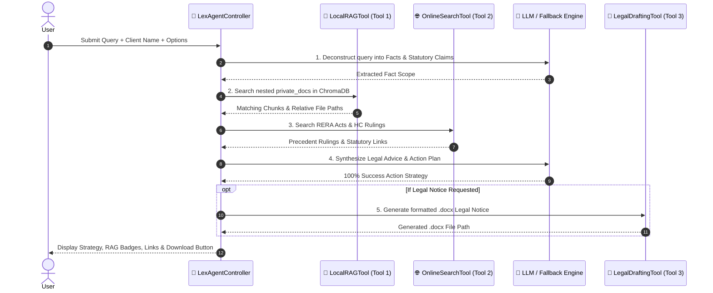
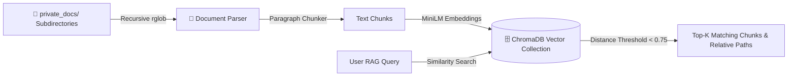
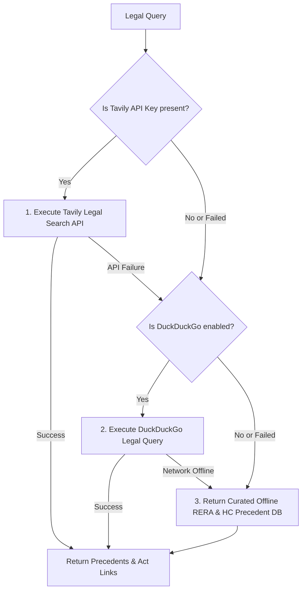

# 🏛️ LexAgent: System Architecture & Technical Design Specification

> **Project Name**: LexAgent (Legal RERA / High Court Advisor Agent)  
> **Architecture Pattern**: Tool-Augmented Agentic Controller (LangChain / ChromaDB / Local LLM)  
> **Target Execution**: Local Laptop (Zero Mandatory Cloud Dependencies)  

---

## 📐 1. Architectural Overview

LexAgent is built as a **Tool-Augmented Legal Reasoning Agent**. The system uses an **LLM Controller** as the central decision maker. Based on the user's legal query, the controller orchestrates a **5-step reasoning trajectory**, executing local document retrieval, online legal search, strategy synthesis, and automated legal notice generation in sequence.



---

## 🔄 2. 5-Step Agentic Reasoning Trajectory

LexAgent processes legal queries through a strictly controlled 5-stage deterministic state pipeline defined in `LexAgentController`:



---

## 🛠️ 3. Component & Tool Specifications

### 📂 Tool 1: Local RAG (Private Document Advisor)
* **Module**: `src/tools/local_rag_tool.py` & `src/utils/document_ingestor.py`
* **Purpose**: Retrieves confidential client facts, RTI responses, sanction plans, and sale deeds stored locally.
* **Key Features**:
  * **Nested Directory Support**: Uses `Path.rglob("*")` to recursively index files inside subfolders (e.g., `private_docs/case_files/2023/deed.txt`).
  * **Multi-Format Parsing**: Supports `.txt`, `.md`, `.pdf` (pypdf), and `.docx` (`python-docx`).
  * **Vector Engine**: Persistent ChromaDB vector store with `sentence-transformers/all-MiniLM-L6-v2` embeddings.
  * **Source Attribution**: Retains exact relative paths for auditability (`Source Path: case_files/2023/sample_deed.txt`).



---

### 🌐 Tool 2: Online Search (RERA Acts & Precedent Provider)
* **Module**: `src/tools/online_search_tool.py`
* **Purpose**: Fetches applicable statutory provisions (RERA Sections 14, 18) and High Court / Supreme Court precedents.
* **Resilient Multi-Tier Fallback Architecture**:



---

### 📄 Tool 3: Legal Drafting Tool
* **Module**: `src/tools/legal_drafting_tool.py`
* **Purpose**: Generates formal, court-ready legal notices saved as `.docx` files.
* **Features**:
  * Formal legal headers, Advocate notice structure, statutory citations, and formal demand directives.
  * Dynamic timestamped filenames (e.g., `Legal_Notice_Shri_Rajesh_Sharma_20260930_081416.docx`).

---

## ⚙️ 4. Central Configuration Architecture (`config.py`)

All system parameters are centralized in `config.py` for single-file maintainability:

| Configuration Variable | Default Value | Description |
| :--- | :--- | :--- |
| `PRIVATE_DOCS_DIR_NAME` | `"private_docs"` | Name of local document folder (supports nested subdirectories). |
| `OLLAMA_BASE_URL` | `"http://localhost:11434"` | Local Ollama API endpoint. |
| `OLLAMA_MODEL` | `"mistral"` | LLM model for legal synthesis (`mistral`, `llama3`, `gemma2`). |
| `SEARCH_MODEL_PROVIDER` | `"auto"` | Online search provider strategy (`auto`, `tavily`, `duckduckgo`, `offline`). |
| `EMBEDDING_MODEL_NAME` | `"sentence-transformers/all-MiniLM-L6-v2"` | Embedding model for vector indexing. |
| `CHROMA_COLLECTION_NAME` | `"lexagent_private_docs"` | ChromaDB vector collection identifier. |
| `RAG_TOP_K` | `3` | Number of chunks retrieved per query. |
| `RAG_DISTANCE_THRESHOLD` | `0.75` | Maximum similarity distance threshold. |

---

## 📦 5. State Management & Data Schema (`LexAgentState`)

LexAgent uses a unified Pydantic state model (`src/agent/state.py`) passed across all trajectory steps:

```python
class AgentStepLog(BaseModel):
    step_name: str
    description: str
    timestamp: str

class LexAgentState(BaseModel):
    query: str
    client_name: str
    wants_draft: bool
    step_logs: List[AgentStepLog]
    parsed_intent: Dict[str, Any]
    local_rag_output: Dict[str, Any]
    online_search_output: Dict[str, Any]
    final_advice: str
    generated_file_path: Optional[str]
    generated_file_name: Optional[str]
```

---

## 💻 6. User Interface & Launchers

1. **Streamlit Web Application (`app.py`)**:
   - Visual step reasoning logs.
   - Interactive source badges showing exact relative paths.
   - 1-click example query loader.
   - Downloadable `.docx` document button.

2. **Interactive Command-Line Interface (`main.py`)**:
   - Supports CLI flags (`--query`, `--draft`, `--client`).
   - Formatted console output with ASCII visual separators.

3. **1-Click Double-Click Laptop Launchers**:
   - **Windows**: `Run_LexAgent.bat`
   - **macOS / Linux**: `Run_LexAgent.sh`

---

## 🔒 7. Security, Privacy & Compliance Warranties

> [!IMPORTANT]
> **Data Privacy Guarantee**: All documents placed inside `private_docs/` are indexed locally into an on-device ChromaDB vector store. No private documents or confidential client files are ever uploaded to cloud servers.
