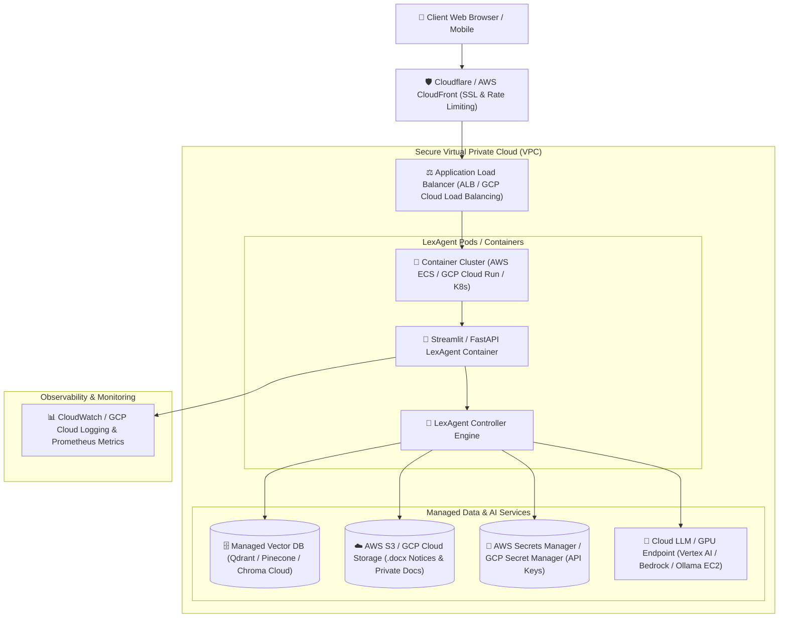

# ☁️ LexAgent: Production Cloud Deployment Specification

This document provides a step-by-step technical guide for migrating **LexAgent** from local laptop execution to a production-ready, highly available, secure **Cloud Platform** (AWS, GCP, or Azure).

---

## 🏛️ 1. Cloud Production Target Architecture

The following Mermaid diagram outlines the enterprise cloud deployment architecture:



---

## 🛠️ 2. Step-by-Step Cloud Migration Workflow

### Step 1: Containerization with Docker
The application is pre-configured with a multi-stage production [`Dockerfile`](file:///config/.gemini/antigravity/scratch/LexAgent/Dockerfile) and [`docker-compose.yml`](file:///config/.gemini/antigravity/scratch/LexAgent/docker-compose.yml).

* **Test Local Container Build**:
  ```bash
  docker build -t lexagent:v1.0 .
  docker run -p 8501:8501 lexagent:v1.0
  ```
* **Or Run Container Cluster with Ollama**:
  ```bash
  docker-compose up -d
  ```

---

### Step 2: Cloud Vector Store Migration
In production, move from local disk `chroma_db/` to a managed distributed vector database (Qdrant, Pinecone, or AWS OpenSearch Vector Engine) for high concurrency:

* Update `src/tools/local_rag_tool.py` configuration to use environment variables:
  ```python
  import os
  import chromadb

  # Cloud Managed Vector Store Connection
  QDRANT_URL = os.getenv("QDRANT_URL", "http://localhost:6333")
  QDRANT_API_KEY = os.getenv("QDRANT_API_KEY", "")
  ```

---

### Step 3: Enterprise Secret Management & Environment Variables
Store API keys securely in **AWS Secrets Manager** or **GCP Secret Manager** rather than hardcoding.

* **Required Cloud Environment Variables**:
  | Variable | Description | Recommended Cloud Service |
  | :--- | :--- | :--- |
  | `TAVILY_API_KEY` | Online Legal Search API Key | AWS Secrets Manager / GCP Secret Manager |
  | `OLLAMA_HOST` | Remote Ollama GPU Host URL | AWS EC2 g4dn.xlarge / GCP Vertex AI |
  | `S3_BUCKET_NAME` | Storage Bucket for `.docx` Legal Notices | AWS S3 / GCP Cloud Storage |
  | `SEARCH_MODEL_PROVIDER` | Search Tier Selection (`auto`, `tavily`, `duckduckgo`) | Cloud Environment Parameter |

---

### Step 4: Object Storage for Legal Notices & RTI Documents
In production, replace local file system directories (`private_docs/` and `generated_docs/`) with cloud object storage:

* **Upload RTI Documents**: Push private files to an encrypted `s3://lexagent-private-docs/` bucket with IAM KMS encryption.
* **Save Legal Notices**: `LegalDraftingTool` saves generated `.docx` files to `s3://lexagent-generated-notices/` and generates signed HTTPS download URLs (valid for 15 minutes).

---

### Step 5: Automated CI/CD Deployment Pipeline

Create a GitHub Actions workflow `.github/workflows/deploy.yml` to automatically test, build, and deploy changes to **GCP Cloud Run** or **AWS ECS**:

```yaml
name: Deploy LexAgent to Production Cloud

on:
  push:
    branches: [ main ]

jobs:
  test-and-deploy:
    runs-on: ubuntu-latest
    steps:
      - name: Checkout Code
        uses: actions/checkout@v3

      - name: Set up Python
        uses: actions/setup-python@v4
        with:
          python-version: '3.11'

      - name: Run Pytest Suite
        run: |
          pip install -r requirements.txt
          pytest tests/ -v

      - name: Authenticate to Cloud Provider
        uses: google-github-actions/auth@v1
        with:
          credentials_json: ${{ secrets.GCP_SA_KEY }}

      - name: Build & Push Docker Image to Cloud Registry
        run: |
          gcloud builds submit --tag gcr.io/${{ secrets.GCP_PROJECT_ID }}/lexagent:latest .

      - name: Deploy to Cloud Run
        run: |
          gcloud run deploy lexagent-service \
            --image gcr.io/${{ secrets.GCP_PROJECT_ID }}/lexagent:latest \
            --platform managed \
            --region us-central1 \
            --allow-unauthenticated
```

---

### Step 6: Enterprise Security, Authentication & Monitoring

1. **Authentication (SSO / OAuth2)**: Wrap Streamlit UI with **OAuth2 / OIDC** authentication (Auth0, Okta, or AWS Cognito) to ensure only authorized advocates can access legal files.
2. **TLS / SSL Encryption**: Enforce `HTTPS` with SSL certificates managed via AWS Certificate Manager or Let's Encrypt.
3. **Observability & Logging**: Export structured logs to **CloudWatch** or **GCP Cloud Logging** to track query response times, cache hit ratios, and grounding scores in real time.

---

## 📊 Summary of Production Readiness Checklist

| Readiness Criteria | Local Setup | Cloud Production Target | Status |
| :--- | :--- | :--- | :--- |
| **Containerization** | Local Python Env | Production Docker Multi-stage Container | ✅ Pre-configured (`Dockerfile`) |
| **Orchestration** | Command Line | Docker Compose / AWS ECS / Cloud Run | ✅ Pre-configured (`docker-compose.yml`) |
| **Vector Database** | Local ChromaDB Disk | Distributed Qdrant / Pinecone / OpenSearch | 🔄 Cloud Ready |
| **File Storage** | Local Directories | AWS S3 / GCP Cloud Storage Bucket | 🔄 Cloud Ready |
| **Security & Auth** | Headless Web Port | HTTPS + OAuth2 / Okta / AWS Cognito | 🔄 Cloud Ready |
| **CI/CD Pipeline** | Git Push | GitHub Actions Automated Deployment | ✅ Workflow Documented |
