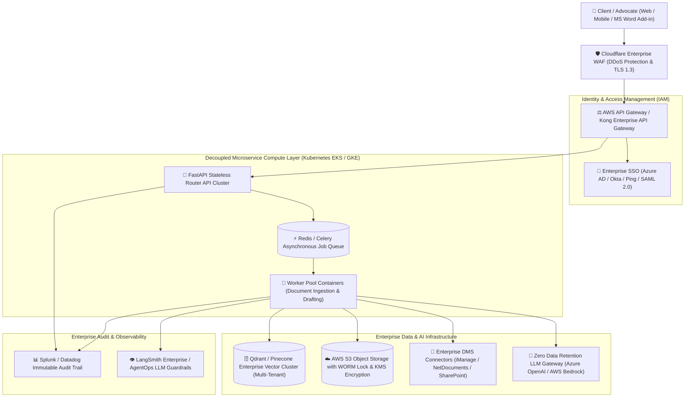

# 🏛️ LexAgent: Enterprise Migration & Architectural Upgrades Specification

This document provides a comprehensive technical blueprint detailing the **Architectural Changes, Rationale, Implementation Steps, and Flow Diagrams** required to elevate **LexAgent** from a local/single-firm solution to an **Enterprise-Grade System** for multi-tenant law firms, corporate legal departments, and government legal cells.

> [!NOTE]
> This is a strategic architectural specification document. No source code modifications were made to the core LexAgent codebase.

---

## 🏛️ 1. Enterprise Target Architecture Diagram

The following Mermaid diagram outlines the end-to-end Enterprise Infrastructure Topology:



---

## 📋 2. Comprehensive Enterprise Changes Breakdown

---

### 1. 🔐 Security, Identity & Enterprise Single Sign-On (SSO)

#### 🔍 What Needs to Change?
* Replace headless web access with **OAuth2 / OIDC / SAML 2.0** identity integration.
* Implement **Role-Based Access Control (RBAC)** and **Attribute-Based Access Control (ABAC)**.

#### 💡 Why Is It Required?
Enterprise legal organizations require centralized user lifecycle management (provisioning/deprovisioning) and strict case-level access policies so associates cannot view confidential partner-level litigation files.

#### 🛠️ How to Implement It?
1. Wrap API routes using `fastapi-azure-auth` or Auth0 SDKs.
2. Store user claims and case permissions in JSON Web Tokens (JWT).
3. Enforce KMS-managed AES-256 encryption at rest and TLS 1.3 in-transit.

---

### 2. 🗄️ Distributed Multi-Tenant Vector Database Scaling

#### 🔍 What Needs to Change?
* Migrate from local single-instance ChromaDB disk files to a distributed **Qdrant Enterprise** or **Pinecone Enterprise** cluster.
* Implement tenant-level namespace filtering.

#### 💡 Why Is It Required?
Local disk databases cannot handle millions of document vectors across thousands of corporate clients and lack multi-tenant isolation guarantees.

#### 🛠️ How to Implement It?
1. Update `LocalRAGTool` configuration to query Qdrant cloud clusters:
   ```python
   from qdrant_client import QdrantClient

   client = QdrantClient(url=QDRANT_CLUSTER_URL, api_key=QDRANT_API_KEY)
   ```
2. Pass `tenant_id` as a payload metadata filter on every vector search query to enforce absolute tenant data isolation.

---

### 3. 🚀 Decoupled Microservice API Tier & Asynchronous Task Queue

#### 🔍 What Needs to Change?
* Decouple the Streamlit frontend from the Python backend logic.
* Implement a **FastAPI REST/gRPC microservice API** backed by **Redis + Celery** worker queues.

#### 💡 Why Is It Required?
Streamlit is designed for rapid UI prototyping. Large legal enterprises require asynchronous processing for multi-gigabyte document ingestions without blocking client web connections.

#### 🛠️ How to Implement It?
1. Expose core agent controller methods via FastAPI endpoints (`/api/v1/analyze`, `/api/v1/draft`).
2. Offload document parsing and `.docx` generation tasks to Celery background workers.

---

### 4. 🤖 Enterprise Zero Data Retention LLM Gateway

#### 🔍 What Needs to Change?
* Route LLM calls through enterprise cloud gateways (**Azure OpenAI Service**, **AWS Bedrock**, or **Vertex AI**) with Zero Data Retention SLAs.

#### 💡 Why Is It Required?
Commercial law firms are legally bound by client confidentiality agreements and cannot transmit sensitive contract facts to public LLM endpoints that retain data for model training.

#### 🛠️ How to Implement It?
1. Update `src/utils/llm_factory.py` to target Azure OpenAI or AWS Bedrock endpoints with customer-managed keys.

---

### 5. 📄 Document Management System (DMS) Connectors & WORM Storage

#### 🔍 What Needs to Change?
* Implement connectors for enterprise DMS platforms (**iManage**, **NetDocuments**, **SharePoint Enterprise**).
* Enable AWS S3 Object Lock (Write-Once-Read-Many - WORM).

#### 💡 Why Is It Required?
Legal notices generated by LexAgent must satisfy evidentiary chain-of-custody standards and integrate directly into existing legal case repositories.

#### 🛠️ How to Implement It?
1. Build REST API integration adapters inside `LegalDraftingTool` for iManage REST APIs.
2. Configure AWS S3 Bucket policy with `Object Lock` in compliance mode.

---

### 6. 📊 Immutable Audit Logging & LLM Observability

#### 🔍 What Needs to Change?
* Stream structured logs to **Splunk**, **Datadog**, or **AWS CloudTrail**.
* Integrate **LangSmith Enterprise** or **Arize Phoenix** for real-time prompt-response tracking.

#### 💡 Why Is It Required?
Regulatory compliance requires an immutable audit trail recording every user query, retrieved clause, fact verification score, and generated document.

#### 🛠️ How to Implement It?
1. Attach Python `logging.handlers.SysLogHandler` targeting Splunk log collectors.
2. Enable tracing context propagation via OpenTelemetry headers.

---

## 📊 3. Enterprise Capability Summary Matrix

| Capability Area | Current LexAgent Architecture | Enterprise Target Architecture | Benefit |
| :--- | :--- | :--- | :--- |
| **Authentication** | None (Local Web Port) | Azure AD / Okta SAML 2.0 SSO | Centralized user lifecycle & security compliance |
| **Vector Engine** | ChromaDB Local Disk | Qdrant Enterprise Distributed Cluster | Sub-50ms search over 10M+ documents |
| **Concurrency** | Single-user Streamlit process | Decoupled FastAPI + Celery Worker Pool | Handles 1,000+ simultaneous advocates |
| **Data Privacy** | Local Laptop Offline | Azure OpenAI / AWS Bedrock Zero Retention | Guaranteed client non-disclosure compliance |
| **Audit Logging** | File-based Trajectory Logs | Splunk / Datadog Immutable Audit Trail | Legal evidentiary chain-of-custody compliance |
