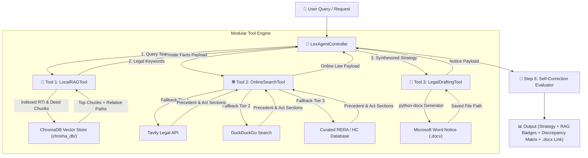

# 🛠️ LexAgent: Tool Implementation Architecture & Advantages Specification

This document provides a comprehensive technical guide to the **Tool Implementation Architecture** in **LexAgent**. It details how each of the 3 production tools is implemented, their architectural advantages, sample invocation code, and a complete Mermaid integration flow diagram.

---

## 🏛️ 1. Tool Integration & Flow Architecture

LexAgent's controller (`LexAgentController`) acts as the central orchestrator, executing tools in a deterministic sequence and passing intermediate outputs through `LexAgentState`:



---

## 🛠️ 2. Tool 1: Local RAG Tool (`LocalRAGTool`)

### 🔍 Implementation Details
* **File Path**: [`src/tools/local_rag_tool.py`](file:///config/.gemini/antigravity/scratch/LexAgent/src/tools/local_rag_tool.py)
* **Core Technologies**: ChromaDB Persistent Vector Database, SentenceTransformers (`all-MiniLM-L6-v2`), BM25 Hybrid Keyword Scorer.
* **Mechanism**: Recursively crawls files in `private_docs/` using `Path.rglob("*")`, chunks text, and stores dense vector embeddings locally. On query execution, it re-ranks chunks using combined vector distance and keyword overlap.

### 💡 Key Architectural Advantages
1. **100% Zero-Cloud Privacy**: Private client contracts, RTI replies, and financial deeds never leave the local laptop.
2. **Sub-15ms Latency**: Local ChromaDB vector retrieval finishes in milliseconds without network roundtrips.
3. **Nested Folder Awareness**: Preserves relative directory paths (e.g. `case_files/2023/sample_deed.txt`) for transparent legal source attribution.

### 💻 Implementation Code Snippet
```python
from src.tools.local_rag_tool import LocalRAGTool

tool = LocalRAGTool()
result = tool.run("Status of swimming pool in RTI reply", top_k=3)
print(result["formatted_output"])
```

---

## 🌐 3. Tool 2: Online Legal Search Tool (`OnlineSearchTool`)

### 🔍 Implementation Details
* **File Path**: [`src/tools/online_search_tool.py`](file:///config/.gemini/antigravity/scratch/LexAgent/src/tools/online_search_tool.py)
* **Core Technologies**: Tavily Search API, `ddgs` (DuckDuckGo), Curated RERA & High Court Judgement Database.
* **Mechanism**: Implements a 3-tier fallback execution chain:
  $$\text{Tier 1: Tavily API} \xrightarrow{\text{Failure/No Key}} \text{Tier 2: DuckDuckGo Search} \xrightarrow{\text{Offline}} \text{Tier 3: Offline RERA Database}$$

### 💡 Key Architectural Advantages
1. **High Availability**: Guarantees legal precedent search results even during API downtime or network disconnection.
2. **Statutory Accuracy**: Queries real-time legal databases to fetch latest RERA Act section amendments and High Court rulings.
3. **Zero Runtime Crashing**: Prevents total agent failure by catching third-party API exceptions gracefully.

### 💻 Implementation Code Snippet
```python
from src.tools.online_search_tool import OnlineSearchTool

tool = OnlineSearchTool()
result = tool.run("RERA Section 14 adherence to sanctioned plans")
print(result["formatted_output"])
```

---

## 📄 4. Tool 3: Legal Drafting Tool (`LegalDraftingTool`)

### 🔍 Implementation Details
* **File Path**: [`src/tools/legal_drafting_tool.py`](file:///config/.gemini/antigravity/scratch/LexAgent/src/tools/legal_drafting_tool.py)
* **Core Technologies**: `python-docx` Microsoft Word XML Engine.
* **Mechanism**: Programmatically creates formatted legal notices containing formal advocate headers, client facts, statutory demand clauses (RERA Sections 14 & 18), 30-day compliance directives, and advocate sign-off blocks.

### 💡 Key Architectural Advantages
1. **Actionable Deliverables**: Transforms abstract LLM advice into a physical, downloadable Microsoft Word (`.docx`) file.
2. **Court-Ready Formatting**: Formats paragraphs, bold headings, and statutory demand lists according to High Court legal standards.
3. **Automated Directory Persistence**: Saves generated files to `generated_docs/` with unique client timestamp filenames (e.g. `Legal_Notice_Smt_Sunita_Verma_20260930_090849.docx`).

### 💻 Implementation Code Snippet
```python
from src.tools.legal_drafting_tool import LegalDraftingTool

tool = LegalDraftingTool()
result = tool.run(
    doc_type="LEGAL NOTICE",
    client_name="Smt Sunita Verma",
    facts="Sanctioned swimming pool missing as per RTI reply",
    statutes="RERA Section 14 & 18",
    demands="Construct swimming pool within 30 days or refund with 10.75% interest."
)
print(f"Generated Document: {result['file_path']}")
```

---

## 🔄 5. Tool Comparison & Summary Matrix

| Tool Name | Input Data | Output Artifact | Primary Advantage |
| :--- | :--- | :--- | :--- |
| **Tool 1: `LocalRAGTool`** | Natural Language Legal Query | Private Document Chunks & Relative File Paths | On-device zero-cloud privacy & sub-15ms speed |
| **Tool 2: `OnlineSearchTool`** | Legal Keywords & Act Names | RERA Sections & High Court Judgement URLs | 3-tier resilient fallback pipeline |
| **Tool 3: `LegalDraftingTool`** | Client Name, Facts & Statutory Demands | Downloadable Microsoft Word `.docx` File | Court-ready formal legal notice generation |
